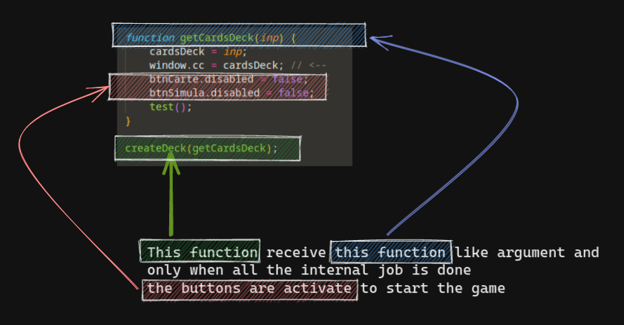
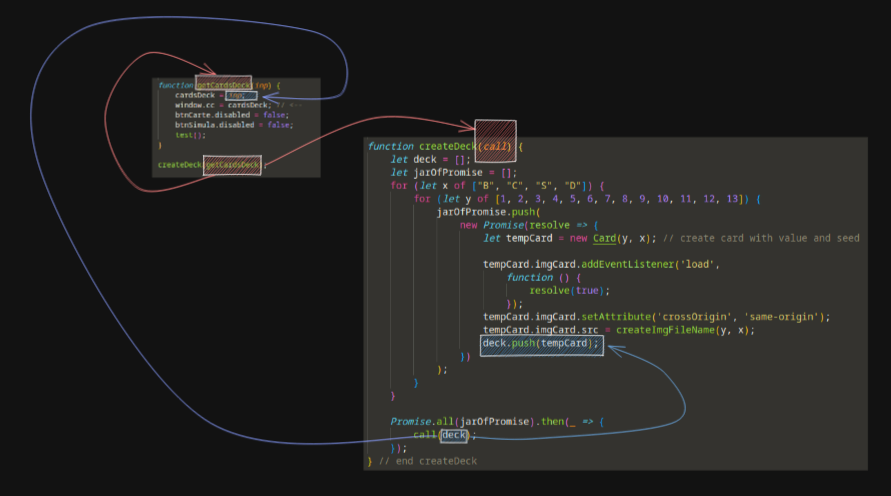

# How to create Deck
This part is very interesting for me.

This is the function for create the Deck.

In the `main` function we call the `createDeck` function from `card.js`.

This function receive `getCardsDeck` function like argument. This is the interesting part
because `getCardsDeck` function expose the `cardsDeck` variable to the function `createDeck`
that fill it with a `Cards` object array generate from a async function when all the promise
are solve.

This mechanism permit to guarantee to exec the function `getCardsDeck` only when all the images of the cards
are loaded.

Only at that time `getCardsDeck` _"run the application"_ enabling the button for example and running all
other parts of the application.
